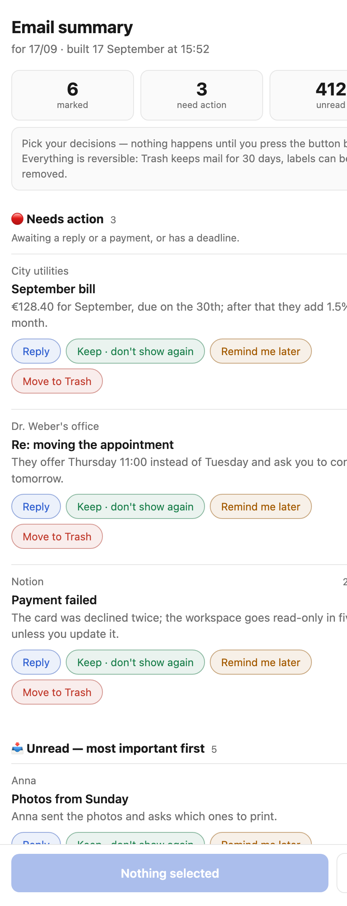

<h1 align="center">svodka</h1>
<p align="center"><b>Одна карточка в день вместо почты.</b></p>

<p align="center">
  <a href="https://claude.ai/code/artifact/d217ae0f-3304-4592-ba26-29bfe6609ec7"></a>
</p>

<p align="center">
  <a href="https://claude.ai/code/artifact/d217ae0f-3304-4592-ba26-29bfe6609ec7"><b>▶ Открыть демо-карточку</b></a> — выдуманная почта, ничего не подключено, ставить нечего
</p>

<p align="center">
  <a href="https://github.com/liza-zaychik/svodka/generate"></a>
</p>

<p align="center"><a href="README.md">In English</a></p>

---

Каждое утро svodka читает твой Gmail, разбирает его по правилам, написанным обычными
словами, и оставляет одну карточку: что требует действия, что стоит прочитать и в чём
она не уверена. Мусор получает ярлык — не удаляется ничего. Решения — одним нажатием,
в том числе с телефона. И неважно, на каком языке пришло письмо: карточка говорит на твоём.

AI-ассистенты отлично раскладывают письма по умным папкам и пишут ответы, в которых
часто нет смысла. Заходить в почту всё равно приходится. svodka — для другого случая:
когда почта вызывает аллергию, а пропустить важное всё равно страшно.

## Три шага

1. **Скопируй.** Нажми *Use this template* выше и сделай свою приватную копию.
2. **Скажи `/setup`.** Открой копию в Claude Code и набери `/setup`. Он задаст несколько
   вопросов про твои правила и всё настроит — минут двадцать, один раз.
3. **Читай одну карточку в день.** Утром приходит короткий пуш, а по ссылке всегда
   свежая сводка. Или не читай неделю — ничего не сломается.

<details>
<summary>На что уходят эти двадцать минут</summary>

- ключ к твоему ящику: бесплатный проект в Google Cloud, самая долгая часть;
- токен, чтобы разбор шёл за счёт твоей подписки Claude, а не платного API;
- оба кладутся в секреты твоей копии — больше их никуда вставлять не нужно;
- публикация твоей карточки по постоянной ссылке;
- пробный прогон: полная сводка, в которой в почте ничего не трогается.

`/setup` ведёт по шагам и сам всё проверяет. Те же шаги обычным списком:
[.claude/commands/setup.md](.claude/commands/setup.md).
</details>

## Вопросы, которые задают

### Оно удалит мою почту?
Нет. Само оно делает только одно: вешает на мусор ярлык «🗑 На удаление». Чистишь этот
ярлык ты, когда захочется. Команды удаления в коде вообще нет. В корзину письмо попадает
только по кнопке в карточке — а корзина хранит письма 30 дней.

### Что именно видит ИИ?
Отправителя, тему и первые 200 символов переписки — ту самую серую строчку-превью из
списка входящих. Только немногие письма из «Требует действия» он читает целиком, чтобы
в сводке были настоящая сумма и срок. Это выключается. Вложения не открываются, ссылки
не переходятся.

### А если письмо попробует его обмануть?
Разбор не выполняет команды из писем и не открывает ссылки. Всё, что похоже на фишинг,
попадает в «Проверить» с предупреждением — никогда в «Требует действия». А у самого шага
разбора доступа к почте нет вовсе: ярлыки ставит потом обычный код, не больше лимита за прогон.

### Сколько это стоит?
Ничего сверх того, что уже оплачено. Работает на бесплатных машинах GitHub (прогон
занимает минут восемь в день) и на твоей подписке Claude Pro или Max. Ни серверов,
ни счетов за API.

### Обязательно смотреть каждый день?
Нет. Карточка живёт по одной ссылке и всегда показывает свежую сводку. Утренний пуш
можно выключить — сводка продолжит собираться.

### А если я не говорю по-английски?
Сводка — пересказы, темы, подсказки — пишется на выбранном тобой языке. Кнопки и
заголовки самой карточки есть на английском и русском, а на любой другой язык их
переводит `/setup`.

### Что нужно, чтобы начать?
Ящик Gmail, подписка Claude Pro или Max, аккаунт GitHub и включённый Gmail-коннектор
в Claude (Настройки → Коннекторы) — через него работают кнопки карточки.

## Как подстроить под себя

- **`rules.md`** — сроки хранения, список «не трогать», порядок важности, обычными
  словами. Claude читает его на каждом прогоне. Основа — [`rules.example.md`](rules.example.md).
- **`config.json`** — язык, часовой пояс, сколько писем показывать, названия ярлыков и
  переключатели пуша `notify.ready` и `notify.failed`. Пример — [`config.example.json`](config.example.json).
- **Пробный режим** — полная сводка, но в почте ничего не помечается. Переменная
  репозитория `DRY_RUN` = `true` (Settings → Secrets and variables → Actions → Variables).
- **`ui.json`** — карточка и пуш на языке, кроме английского и русского; `/setup` создаёт его сам.

<details>
<summary>Как это устроено внутри</summary>

```
GitHub Actions, каждое утро (бесплатно)
  → читает Gmail напрямую, по твоему собственному OAuth-ключу
  → Claude раскладывает переписки по rules.md и пишет пересказ в одну строку
    для тех, что ты действительно прочитаешь
  → код помечает мусор и сохраняет сводку черновиком в Gmail
  → во входящие ложится короткое письмо, и пуш присылает сам Gmail

Карточка — артефакт Claude, публикуется один раз, ссылка постоянная
  → при открытии читает свежий черновик
  → кнопки работают с Gmail через твой Gmail-коннектор в Claude
```

Компьютер держать включённым не нужно, сервера нет. Копию держи приватной: логи Actions
публичных репозиториев видны всем, а в них попадает, сколько у тебя писем (но никогда —
что в них написано).

Ограничения: только Gmail, один ящик на копию; GitHub иногда запускает задачи по
расписанию с опозданием на часы, поэтому расписание стоит рано.
</details>

## Лицензия

[MIT](LICENSE)
